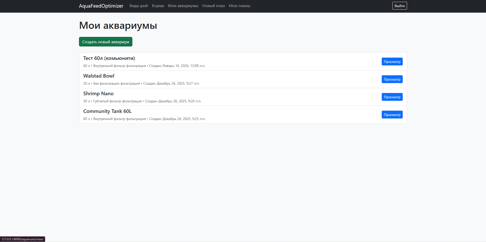
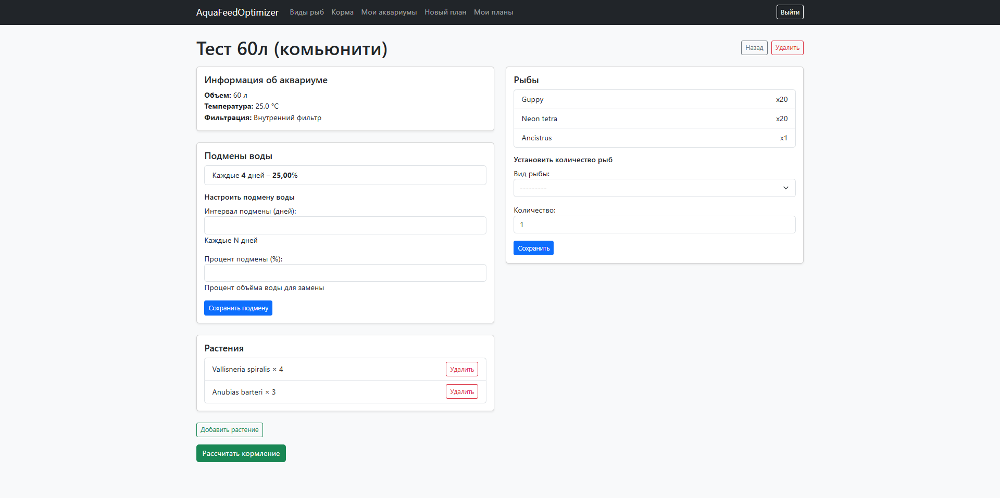
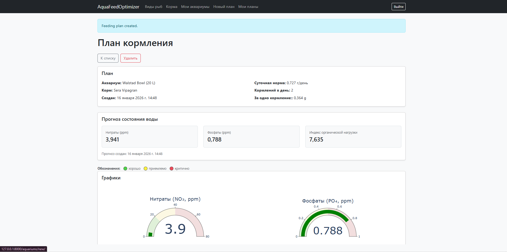
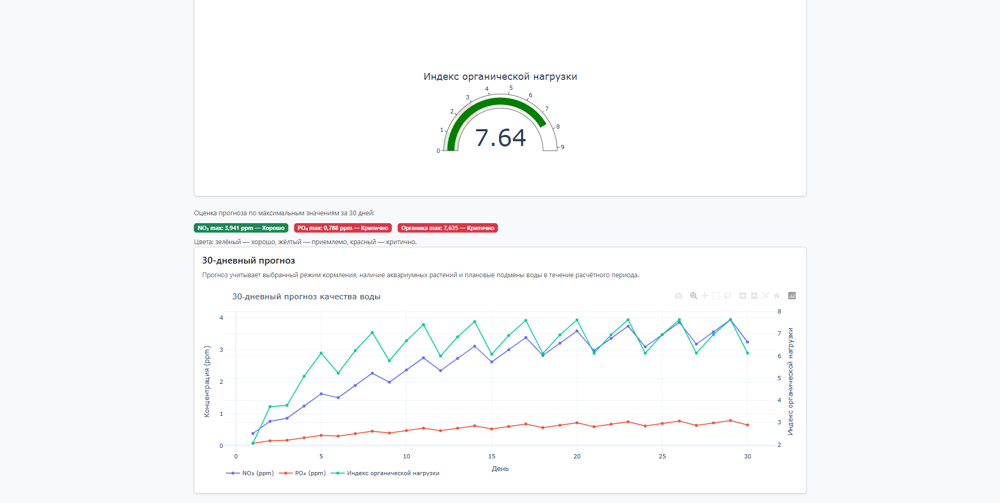
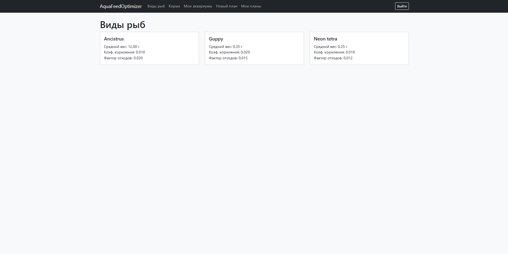
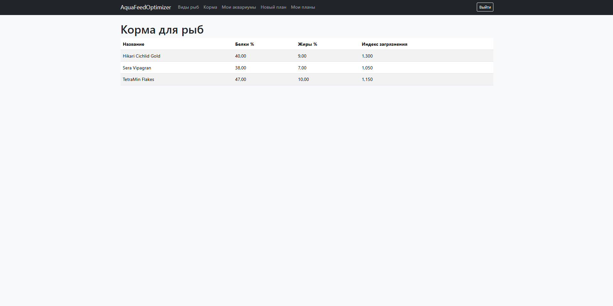

# Aqua Feed Optimizer

Веб‑сервис для аквариумистов: помогает рассчитать оптимальный рацион кормления рыб и спрогнозировать влияние кормления на качество воды (NO₃, PO₄ и индекс органической нагрузки) с учётом параметров аквариума, рыб, растений, фильтрации и плановых подмен воды.

---

## Возможности

- Справочники:
  - виды рыб (с коэффициентами кормления и “грязности”/waste factor),
  - корма (пищевые показатели + pollution index),
  - растения (скорости поглощения NO₃/PO₄).
- Аквариум пользователя:
  - профиль (объём, температура, тип фильтрации),
  - добавление рыб (вид + количество),
  - добавление растений (вид + количество),
  - настройка подмен воды (интервал и процент).
- План кормления:
  - расчёт суточной нормы,
  - количество кормлений в день и порция на одно кормление.
- Прогноз качества воды:
  - 30‑дневная симуляция NO₃/PO₄/органики,
  - учёт растений и подмен воды,
  - индекс органической нагрузки с ежедневным самоочищением,
  - визуализация (гейджи и графики Plotly),
  - оценка “хорошо/приемлемо/критично” по максимумам за 30 дней.
- Управление планами кормления:
  - список “Мои планы”,
  - открытие ранее созданных планов,
  - удаление планов.

---

## Роли пользователей

- **Гость**
  - просмотр справочной информации о рыбах и кормах (без личных данных).
- **Авторизованный пользователь**
  - создание аквариумов, рыб, растений, подмен воды,
  - создание планов кормления и просмотр прогнозов,
  - управление своими планами кормления.
- **Администратор**
  - управление справочниками (рыбы, корма, растения),
  - модерация данных.

---

## Стек технологий

- **Python 3.14**
- **Django 6.0** (веб‑фреймворк, ORM, аутентификация)
- **SQLite** (БД по умолчанию для разработки)
- **Bootstrap 5** (интерфейс)
- **Plotly** (интерактивные графики/гейджи)

---

## Структура репозитория

- `aquafeedOptimizer/` — Django‑проект (settings/urls/wsgi)
- `aquariums/` — аквариумы, растения, подмены воды
- `fish/` — справочник видов рыб и рыбы в аквариуме
- `food/` — справочник кормов
- `feeding/` — планы кормления (создание, список, удаление)
- `water_quality/` — прогноз качества воды и визуализация
- `templates/` — HTML‑шаблоны
- `TZ.md` — техническое задание (обновлённое)

---

---

## Скриншоты

### Аквариумы


### Просмотр аквариума


### План кормления (карточки прогноза)


### План кормления (графики и 30‑дневный прогноз)


### Справочник рыб


### Справочник кормов


---

## Установка и запуск проекта

Ниже приведена инструкция по локальному запуску проекта после скачивания исходников с GitHub.

## 📋 Предварительные требования

Перед началом установки убедитесь, что у вас установлено:

- **Python 3.11** или выше  
- **Git**  
- Доступ к **командной строке / терминалу**  

---

## 🚀 Установка и запуск проекта

### 1️⃣ Загрузка исходников
Скачайте проект с GitHub:
1. Перейдите на страницу проекта.
2. Нажмите зелёную кнопку **Code**.
3. Выберите пункт **Download ZIP**.
4. Распакуйте архив в удобную папку, например:  
   `D:\Test\aquafeed-optimizer-main`  
   *(Папка `aquafeed-optimizer-main` содержит исходный код)*

---

### 2️⃣ Запуск командной строки
Откройте **Командную строку** или **PowerShell** от имени администратора.

---

### 3️⃣ Переход в корневую папку проекта
Если проект находится на другом диске, переключитесь на него:
```bash
D:
```
Затем перейдите в корень проекта:
```bash
cd D:\Test\aquafeed-optimizer-main
```

---

### 4️⃣ Создание виртуального окружения
```bash
python -m venv venv
```

---

### 5️⃣ Активация виртуального окружения
```bash
.\venv\Scripts\activate.bat
```
После активации вы увидите префикс `(venv)` перед путём проекта.

---

### 6️⃣ Установка зависимостей
```bash
pip install -r requirements.txt
```

---

### 7️⃣ Сбор статических файлов
```bash
python manage.py collectstatic
```

---

### 8️⃣ Применение миграций
```bash
python manage.py migrate
```

---

### 9️⃣ (Опционально) Создание суперпользователя
```bash
python manage.py createsuperuser
```
Админ-панель доступна по адресу:  
[http://127.0.0.1:8000/admin/](http://127.0.0.1:8000/admin/)

---

### 🔟 Запуск сервера
```bash
python manage.py runserver
```
После запуска проект будет доступен по адресу:  
[http://127.0.0.1:8000/](http://127.0.0.1:8000/)

---

✅ **Готово!** Проект успешно установлен и запущен.

